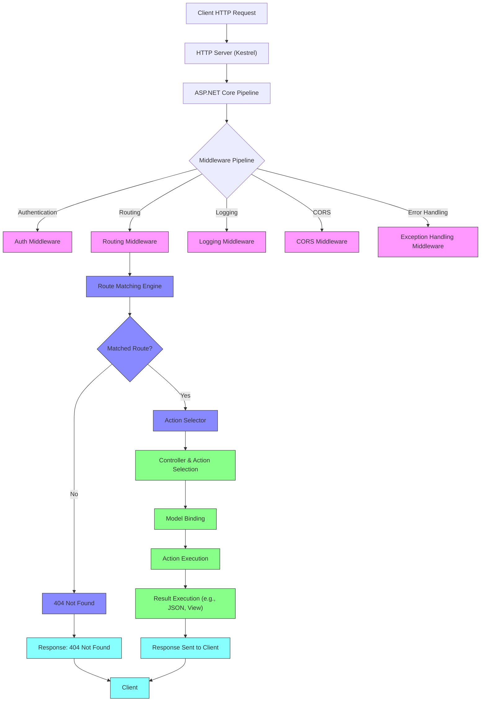
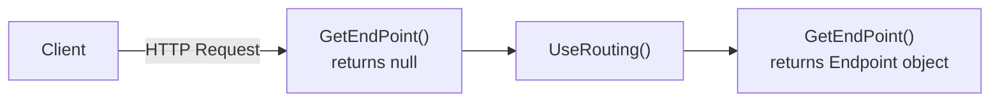
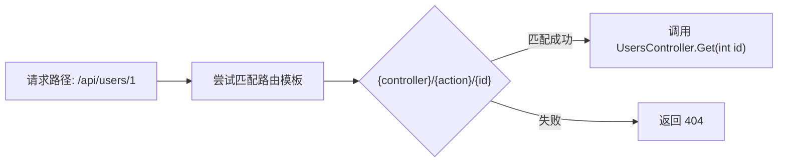



# <center>ASP.NET Core 入门指南</center>

# 第1章. 简介 Introduction

## 1.1 ASP.NET Core 简介

### 1.1.1 什么是 ASP.NET Core

ASP.NET Core 是微软推出的跨平台、高性能、开源的 Web 应用开发框架，可运行在 Windows、Linux、macOS 上，用于构建现代化的 Web 应用、API、微服务、物联网应用及移动后端。它支持云原生部署，具备模块化、轻量化的 HTTP 请求管道，并内置依赖注入、配置管理和安全机制。

### 1.1.2 ASP.NET Core 有什么功能

*   轻型和模块化 HTTP 请求管道。
*   Kestrel： 高性能 和跨平台 HTTP 服务器。
*   集成依赖项注入。
*   基于环境的配置。
*   丰富的日志记录、跟踪和运行时指标。
*   Blazor：使用 C# 创建丰富的交互式 Web UI 组件- 无需 JavaScript。
*   与常用的客户端框架和库无缝集成，包括 Angular、 React、 Vue 和 Bootstrap。
*   最小 API：通过流畅地声明 API 路由和终结点，使用最少的代码和配置生成快速 Web API。
*   SignalR：添加实时 Web 功能。
*   gRPC：高性能远程过程调用（RPC）服务。
*   安全性：用于 身份验证、 授权和 数据保护的内置安全功能。
*   测试：轻松创建单元和集成测试。
*   工具：使用 Visual Studio 和 Visual Studio Code 最大限度地提高开发效率。

### 1.1.3 ASP.NET Core 有什么特性

*   跨平台与开源：可在多操作系统上开发与部署，社区驱动更新。

*   高性能：内置 Kestrel 高性能服务器，性能在 Web 框架中名列前茅。

*   统一开发模型：MVC、Razor Pages、Blazor、Web API 融合。

*   内置安全：支持身份验证、授权、数据保护。

*   云就绪：支持容器化、微服务架构及云平台部署。

### 1.1.4 ASP.NET Core 的组成部分

*   ASP.NET Core MVC
*   ASP.NET Core Web API
*   ASP.NET Core Razor Pages
*   ASP.NET Core Blazor

### 1.1.5 学习 ASP.NET Core 的前置技能

*   C#：Classes 类、Interfaces 接口、Inheritance 继承、async/await 异步、Extension Methods 扩展方法、LINQ、Lambda表达式
*   HTML、CSS、JavaScript、jQuery等前端开发的中级知识
*   数据库：基础SQL操作

## 1.2 为何选择 ASP.NET Core

### 1.2.1 ASP.NET Core 有哪些优势

| 特性/维度 | ASP.NET Core                            | ASP.NET MVC                  | ASP.NET WebForms             |
| ----- | --------------------------------------- | ---------------------------- | ---------------------------- |
| 诞生年份  | 2016                                    | 2009                         | 2002                         |
| 平台支持  | 跨平台（Windows、Linux、macOS）                | 仅 Windows（依赖 .NET Framework） | 仅 Windows（依赖 .NET Framework） |
| 开源状态  | 完全开源（GitHub）                            | 部分开源（底层仍依赖闭源 .NET Framework） | 闭源                           |
| 性能    | 高性能，模块化设计，轻量级中间件管道                      | 性能中等，受限于 .NET Framework      | 性能较低，视图状态（ViewState）开销大      |
| 架构模式  | 支持 MVC、Razor Pages、Web API、Blazor 等多种模式 | 严格遵循 MVC 模式                  | 事件驱动模型，类似 WinForms           |
| 依赖注入  | 内置原生支持                                  | 需第三方库（如 Unity、Autofac）       | 不支持（需手动实现或第三方库）              |
| 中间件管道 | 灵活可配置的中间件管道                             | 基于 HTTP 模块和处理程序（较固定）         | 基于页面生命周期和控件树（复杂且不灵活）         |
| 前端控制  | 完全控制 HTML/CSS/JS，无隐藏状态                  | 完全控制前端输出                     | 自动生成大量隐藏字段（ViewState），前端控制弱  |
| 测试支持  | 高度可测试，天然支持单元测试和集成测试                     | 支持单元测试（控制器可独立测试）             | 难以测试（强耦合页面生命周期和控件）           |
| 部署方式  | 可自托管（Kestrel）、IIS、Nginx、Docker 等        | 仅支持 IIS 托管                   | 仅支持 IIS 托管                   |
| 版本迭代  | 持续更新（每年大版本），长期支持（LTS）                   | 已停止新功能开发（仅安全维护）              | 已淘汰，不再推荐用于新项目                |
| 云原生支持 | 原生支持容器化、微服务、配置系统、日志等                    | 有限支持                         | 不支持                          |
| 学习曲线  | 中等（需理解现代 Web 理念）                        | 中等（熟悉 MVC 即可）                | 低（适合传统桌面开发者）                 |
| 适用场景  | 新项目、微服务、高并发、跨平台部署                       | 维护旧项目、企业内部系统                 | 遗留系统维护（不推荐新项目使用）             |

### 1.2.2 总结

*   新项目首选 ASP.NET Core：具备最佳性能、跨平台能力、现代化架构和长期支持。
*   ASP.NET MVC：适用于维护基于 .NET Framework 的现有项目，但不建议用于新开发。
*   ASP.NET WebForms：已过时，技术债务高，仅用于极个别遗留系统维护。

> 微软官方已明确将发展重心全面转向 ASP.NET Core，并推荐使用 Blazor、Razor Pages 或 Minimal API 等现代开发模式构建新一代 Web 应用。

# 第2章. 准备开始 Getting Started

## 2.1 开发环境设置（前置软件和SDK）

*   [.NET SDK 10](https://dotnet.microsoft.com/zh-cn/)

*   开发工具：
    *   [Visual Studio](https://visualstudio.microsoft.com/) 或者 [Visual Studio Code](https://code.visualstudio.com/) 或者 [Jetbrains Rider](https://www.jetbrains.com.cn/rider/)
    *   数据库：[SQL Server](https://www.microsoft.com/zh-cn/sql-server/sql-server-downloads)
    *   API测试管理工具：[Postman](https://www.postman.com/) 或者 [Hoppscotch](https://hoppscotch.com/)

> Windows 平台下安装 Visual Studio 并选择相应开发组件后会自动安装.NET运行时，Mac 和 Linux 平台需要安装 .NET SDK。

## 2.2 创建第一个 ASP.NET Core 应用

### 2.2.1 命令行创建项目

```powershell
 dotnet new web --no-https true --use-program-main true --language C# --framework net8.0 -n MP001 -o ./
```

### 2.2.2 图形GUI创建项目（略）

## 2.3 Kestrel 和其他服务器软件

### 2.3.1 应用服务器

Kestrel：Kestrel是ASP.NET Core应用程序的默认跨平台HTTP服务器，它充当开发服务器，也作为能接收真实互联网请求的实际应用服务器。

### 2.3.2 反向代理服务器

*   IIS
*   Nginx
*   Apache

### 2.3.3 Kestrel应用服务器和反向代理服务器的组合方案


## 2.4 启动文件设置

顾名思义，launchSettings.json是一个在应用启动时自动来加载的配置文件，该配置文件可以采用不同的设置启动应用程序。下面使用Visual Studio 2026 在ASP.NET Core 10 环境下自动创建的launchSettings.json文件的全部内容。

### 2.4.1 launchSettings.json默认配置概览

```json
{
  "$schema": "https://json.schemastore.org/launchsettings.json",
  "profiles": {
    "http": {
      "commandName": "Project",
      "dotnetRunMessages": true,
      "launchBrowser": true,
      "applicationUrl": "http://localhost:5014",
      "environmentVariables": {
        "ASPNETCORE_ENVIRONMENT": "Development"
      }
    },
    "https": {
      "commandName": "Project",
      "dotnetRunMessages": true,
      "launchBrowser": true,
      "applicationUrl": "https://localhost:7017;http://localhost:5014",
      "environmentVariables": {
        "ASPNETCORE_ENVIRONMENT": "Development"
      }
    }
  }
}

```

> **在 .NET 8+ 开始，Visual Studio 与 CLI 默认不再自动为新项目添加 iisExpress 配置项，原因如下：**
>
> | 原因                           | 说明                                                                |
> | ---------------------------- | ----------------------------------------------------------------- |
> | **Kestrel 作为默认开发服务器的能力大幅提升** | Kestrel 已经非常稳定，支持 HTTPS、调试、反向代理、热重载等，完全满足本地开发需求，无需依赖 IIS Express。 |
> | **IIS Express 在本地开发中使用率下降**  | 现代 ASP.NET Core 应用多用于云原生、Docker、微服务，IIS Express 部署意义不大。           |
> | **简化项目结构与配置管理**              | 保留冗余配置会增加心智负担，降低可维护性。                                             |
>
> **隐藏 IIS Express 是为了推动“统一开发体验”**
>
> ASP.NET Core 团队希望开发者：
>
> > 主要使用 Kestrel 进行开发调试；
> >
> > 通过 applicationUrl 指定端口；
> >
> > 仅在需要 IIS 集成部署（如 web.config、appCmd.exe、旧版 Windows Server）时才使用 IIS Express。
>
> 这有助于：
>
> > 减少对 Web Server 的依赖误解；
> >
> > 增强跨平台能力（IIS Express 仅 Windows 可运行）；

### 2.4.2 launchSettings.json配置详解

#### 2.4.2.1 JSON配置

在ASP.NET Core 8及以前的环境中，该配置文件默认添加了iisSettings和profiles两个节点，iisSettings节点提供IIS相关的配置，profiles节点定义了一系列不同场景的Profile。

```json
{
  "$schema": "http://json.schemastore.org/launchsettings.json",
  "iisSettings": {
    "windowsAuthentication": false,
    "anonymousAuthentication": true,
    "iisExpress": {
      "applicationUrl": "http://localhost:5370",
      "sslPort": 0
    }
  },
  "profiles": {
    "http": {
      "commandName": "Project",
      "dotnetRunMessages": true,
      "launchBrowser": true,
      "applicationUrl": "http://localhost:5148",
      "environmentVariables": {
        "ASPNETCORE_ENVIRONMENT": "Development"
      }
    },
    "IIS Express": {
      "commandName": "IISExpress",
      "launchBrowser": true,
      "environmentVariables": {
        "ASPNETCORE_ENVIRONMENT": "Development"
      }
    }
  }
}

```

初始的launchSettings.json配置文件会默认创建两个Profile，一个被命名为“IIS Express”，另一个则使用应用名称命名（App）。每个Profile相当于定义了应用启动时采用的设置，包括应用启动的方式、环境变量和URL等，具体设置如下：

*   **commandName**:启动当前应用程序的命令类型，有效的选项包括IIS、IISExpress、Executable和Project，前3个选项分别表示采用IIS、IIXExpress和指定的可执行文件（.exe）来启动应用程序。如果使用"dotnet run"命令启动应用程序，则需要将对应Profile的commandName属性设置为Project。
*   **executablePath**：如果commandName属性的值被设置亩Executable，则需要利用executablePath属性设置启动可执行文件的路径（绝对路径或相对路径）。
*   **environmentVariables**：该属性用来设置环境变量。由于launchSettings.json配置文件只在开发环境中使用，所以默认会添加一个名为“ASPNETCORE\_ENVIRONMENT”的环境变量来表示当前部署环境的。
*   **commandLineArgs**：命令行参数，即传入main方法的参数列表。如果采用“顶级语句”特性，则对应ars变量。
*   **workingDirectory**：启动当前应用运行的工作目录。
*   **applicationUrl**：应用程序采用的URL列表，多个URL之间使用英文分号（;）分隔。
*   **launchBrowser**：一个布尔类型的开关，表示应用程序启动时是否自动启动浏览器。
*   **launchUrl**：如果launchBrowser属性的值被设置为True，则浏览器采用的初始化路径通过launchUrl属性进行设置。
*   **nativeDebugging**：是否启动本地代码调试（Native Code Debugging），默认值为False。
*   **externalUrlConfiguration**：如果该属性的值被设置为True，就意味着禁用本地配置，默认值为False。
*   **use64Bit**：如果commandName属性的值被设置为IIS Express，则use64Bit属性决定采用x64版本还是x86版本，默认值为False，这样ASP.NET Core应用默认采用x86版本的IIS Express。

#### 2.4.2.2 GUI配置

launchSettings.json配置文件中的所有设置仅仅针对开发环境，在产品（Production）环境下是不需要这个配置这个文件的，所以应用发布后生成的文件列表中也不包含该配置文件。该配置文件其实不需要手动编辑，当前项目属性对话框（右键点击项目 -> 选择“属性” -> 进入“调试”选项卡）中的“Debug”选项卡下的所有设置最终都会体现在该配置文件止。


### 2.4.3 launchSettings.json启动加载

#### 2.4.3.1 通过 Visual Studio 工具栏选择指定Profile启动项目

如果在launchSettings.json配置文件中设置了多个Profile，则它们会以图示的形式出现在Visual Studio的工具栏中。我们可以选择任意一个Profile来启动当前程序。如果在Profile中通过设置launchBrowser属性决定启动浏览器，则可以选择浏览器的类型。


#### 2.4.3.2 通过 Dotnet 命令选择指定Profile启动项目

如果我们通过执行“dotnet run”命令启动项目应用程序，则lanchSettings.json配置文件默认会被加载。我们可以通过命令行参数“--launch-profile”指定采用的Profile。如果没有对Profile做显式指定，则默认选择配置文件中的第一个“commandName”为“Project”的Profile。

```powershell
dotnet run --project MP001 --launch-profile http
```


如果在执行“dotnet run”命令时不希望加载launchSettings.json配置文件，则可以显式指定命令行参数“--no-launch-profile”。

```powershell
dotnet run --project MP001 --no-launch-profile
```


#### 2.4.3.3 在项目配置文件中排除launchSettings.json文件的生成

如果不需要生成这个launchSettings.json配置文件，则可以修改项目文件并按照如下方式添加一个名为“NoDefaultLaunchSettingsFile”的属性。


```xml
<Project Sdk="Microsoft.NET.Sdk.Web">

  <PropertyGroup>
    <TargetFramework>net10.0</TargetFramework>
    <Nullable>enable</Nullable>
    <ImplicitUsings>enable</ImplicitUsings>
    <NoDefaultLaunchSettingsFile>true</NoDefaultLaunchSettingsFile>
  </PropertyGroup>

</Project>

```

### 2.4.4 托管模型（项目启动时用的服务器）

在launchSettings还可以进行Kestrel和IIS以及IIS Express托管模型的配置。

<table>
    <tr>
        <th>CommandName</th><th>Asp.NetCoreHostingModel</th><th>Internal Web Server</th><th>External Web Server</th>
    </tr>
    <tr>
        <td>Project</td><td>Hosting Setting Ignored</td><td colspan="2">Only one web server is used - Kestrel</td>
    </tr>
    <tr>
        <td rowspan="2">IIS Express</td><td>InProcess</td><td colspan="2">Only one web server is used - IIS Express</td>
    </tr>
    <tr>
        <td>OutOfProcess</td><td>Kestrel</td><td>IIS Express</td>
    </tr>
    <tr>
        <td rowspan="2">IIS</td><td>InProcess</td><td colspan="2">Only one web server is used - IIS</td>
    </tr>
    <tr>
        <td>OutOfProcess</td><td>Kestrel</td><td>IIS</td>
    </tr>
</table>

# 第3章 初识 HTTP

## 3.1 HTTP 协议

HTTP（HyperText Transfer Protocol，超文本传输协议）是互联网上应用最广泛的协议之一，用于在客户端（如浏览器）和服务器之间传输超文本（如网页）。

HTTP 是万维网（WWW）的基础，支持网页浏览、文件下载、API 调用等应用场景。

## 3.2 HTTP 请求响应工作原理


### 3.2.1 原理简述

1.  **客户端发起请求**\
    用户在浏览器中输入网址（如 `https://example.com/api/users`），浏览器根据 URL 构造一条 **HTTP 请求**，包含：

    *   请求方法（如 `GET`、`POST`）
    *   请求头（如 `User-Agent`、`Content-Type`）
    *   可选请求体（如 JSON 数据）
2.  **建立 TCP 连接（可选 TCP/SSL）**

    *   客户端向服务器发起 TCP 连接请求。
    *   如果是 HTTPS，则通过 **TLS/SSL 握手** 加密通信，保障安全。
3.  **服务器接收请求并处理**

    *   Web 服务器（如 Nginx、Apache）或应用服务器（如 Kestrel、Tomcat）接收请求。
    *   根据请求路径（URL）、方法、头信息，定位到对应的服务逻辑（如 ASP.NET Core 控制器方法）。
    *   执行业务逻辑（如查询数据库、调用 API）。
4.  **服务器返回响应**\
    服务器构造一个 **HTTP 响应**，包含：

    *   状态码（如 `200 OK`、`404 Not Found`、`500 Internal Server Error`）
    *   响应头（如 `Content-Type`、`Cache-Control`）
    *   可选响应体（如 JSON 数据、HTML 页面）
5.  **客户端接收并处理响应**

    *   浏览器收到响应后：

        *   若是 HTML，解析并渲染页面；
        *   若是 JSON，通过 JavaScript 处理并更新页面；
        *   若是文件（如图片、PDF），下载或显示；
    *   根据响应头决定是否缓存、重定向或跳转。
6.  **连接关闭（或复用）**

    *   HTTP/1.1 默认 **Keep-Alive**，可复用连接；
    *   HTTP/2 支持多路复用，更高效；
    *   通信结束后，连接关闭或等待下一次请求。

### 3.2.2 生活类比

> *就像你去餐厅点餐：*
>
> *   ***你写菜单条**（客户端发请求）*
> *   ***服务员拿去厨房**（服务器接收）*
> *   ***厨师做菜**（服务器处理）*
> *   ***服务员端菜回来**（服务器返回响应）*
> *   ***你吃掉或退菜**（客户端处理结果）*

### 3.2.3 一句话总结

> 客户端发请求 → 服务器收请求 → 处理逻辑 → 返回响应 → 客户端接收处理 → 可能再次请求

## 3.3 HTTP 的关键特性

1.  **无状态协议**：

    *   每次请求都是独立的，服务器不会保存客户端的状态。
    *   通过 Cookie 或 Session 实现状态管理。
2.  **支持多种请求方法**：

    *   **GET**：获取资源。
    *   **POST**：提交数据。
    *   **PUT**：更新资源。
    *   **DELETE**：删除资源。
3.  **支持多种数据类型**：

    *   通过 `Content-Type` 头指定数据类型（如 `text/html`、`application/json`）。
4.  **缓存机制**：

    *   通过 `Cache-Control` 和 `ETag` 头实现缓存，提高性能。
5.  **可扩展性**：

    *   支持自定义请求头和响应头，扩展功能。

## 3.4 HTTP 响应

### 3.4.1 **HTTP 响应结构**

HTTP 响应由以下部分组成：

1.  **状态行**：包括协议版本（如 HTTP/1.1）、状态码（如 200）和状态消息（如 OK）。
2.  **响应头**：包含附加信息（如 `Content-Type`、`Content-Length`）。
3.  **响应体**：包含实际数据（如 HTML 内容）。

```http
HTTP/1.1 200 OK
Content-Type: text/html
Content-Length: 1234

<html>...</html>
```


### 3.4.2 HTTP 响应状态码

#### 3.4.2.1 常见 HTTP 响应状态码汇总表（截至 HTTP/1.1）

| 状态码   | 状态描述                      | 含义说明                      | 典型使用场景                            | ASP.NET Core 对应 `HttpResponse.StatusCode` |
| ----- | ------------------------- | ------------------------- | --------------------------------- | ----------------------------------------- |
| `100` | Continue                  | 客户端应继续发送请求体（部分请求已接收）      | 用于分块上传前的预检                        | `100`                                     |
| `101` | Switching Protocols       | 服务器同意切换协议（如升级为 WebSocket） | WebSockets、SPDY                   | `101`                                     |
| `102` | Processing (RFC 2518)     | 服务器正在处理请求，响应可能延迟          | WebDAV 操作                         | `102`                                     |
| `200` | OK                        | 请求成功，响应体包含结果              | GET、PUT、POST 等成功操作                | `200`                                     |
| `201` | Created                   | 资源创建成功，响应中包含新资源位置         | 创建资源后返回 `Location` 头              | `201`                                     |
| `202` | Accepted                  | 请求已接受但尚未处理完成              | 异步任务、后台处理                         | `202`                                     |
| `204` | No Content                | 请求成功，但无响应体（无内容返回）         | 删除操作、清空缓存                         | `204`                                     |
| `206` | Partial Content           | 服务器成功执行了范围请求（如断点续传）       | 大文件下载、分块传输                        | `206`                                     |
| `301` | Moved Permanently         | 资源已永久移动到新 URL             | SEO 重定向、API 版本迁移                  | `301`                                     |
| `302` | Found (Moved Temporarily) | 资源临时移动到新 URL              | 临时跳转、重定向登录页                       | `302`                                     |
| `304` | Not Modified              | 客户端缓存有效，无需重新传输            | 基于 `ETag` 或 `Last-Modified` 的缓存优化 | `304`                                     |
| `307` | Temporary Redirect        | 临时重定向，保留原始请求方法（如 POST）    | 保持请求方法的重定向                        | `307`                                     |
| `308` | Permanent Redirect        | 永久重定向，保留请求方法              | 与 301 类似，但强调方法不变                  | `308`                                     |
| `400` | Bad Request               | 请求语法错误或格式无效               | 参数缺失、JSON 解析失败                    | `400`                                     |
| `401` | Unauthorized              | 请求需身份验证（未认证）              | 未登录、缺少 token                      | `401`                                     |
| `403` | Forbidden                 | 有权限但拒绝访问                  | 权限不足、IP 黑名单                       | `403`                                     |
| `404` | Not Found                 | 请求的资源不存在                  | 路由错误、URL 拼写错误                     | `404`                                     |
| `405` | Method Not Allowed        | 请求方法不被支持                  | 对某路径使用了非法方法（如 GET 到 POST 接口）      | `405`                                     |
| `408` | Request Timeout           | 客户端请求超时                   | 客户端连接太久未发送完成                      | `408`                                     |
| `409` | Conflict                  | 请求与当前资源状态冲突               | 并发修改、唯一键冲突                        | `409`                                     |
| `410` | Gone                      | 资源已永久删除（比 404 更明确）        | 已移除但不想保留旧链接                       | `410`                                     |
| `412` | Precondition Failed       | 前置条件未满足（如 `If-Match` 不匹配） | 条件更新失败                            | `412`                                     |
| `429` | Too Many Requests         | 请求频率过高（限流）                | API 限流、防刷保护                       | `429`                                     |
| `500` | Internal Server Error     | 服务器内部错误（未处理异常）            | 代码抛出异常未捕获                         | `500`                                     |
| `501` | Not Implemented           | 服务器不支持该功能                 | 未实现的功能 / 接口                       | `501`                                     |
| `502` | Bad Gateway               | 网关或代理服务器收到无效响应            | 反向代理故障、后端服务崩溃                     | `502`                                     |
| `503` | Service Unavailable       | 服务器暂时无法处理请求               | 维护、高并发、资源不足                       | `503`                                     |
| `504` | Gateway Timeout           | 网关在规定时间内未收到响应             | 反向代理等待后端超时                        | `504`                                     |

#### 3.4.2.2 ASP.NET Core 开发提示（推荐用法）

*   使用 `HttpContext.Response.StatusCode` 设置状态码。
*   使用 `context.Response.WriteAsync("...")` + `context.Response.StatusCode = 400` 实现自定义错误。
*   在 Razor Pages / MVC 控制器中可直接返回 `BadRequest()`、`NotFound()`、`Unauthorized()` 等操作结果。
*   对于 400/401/404 等错误，建议结合 `UseStatusCodePages` 或中间件统一处理。

```csharp

// 示例：返回 404
return NotFound("用户不存在");

// 示例：返回 500
return StatusCode(500, "服务内部错误，请联系管理员。");

```

#### 3.4.2.3 示例：在 ASP.NET Core 中自定义响应状态码

```csharp
var builder = WebApplication.CreateBuilder(args);
var app = builder.Build();

app.Run(async (HttpContext context) =>
{
    context.Response.StatusCode = 500;
    await context.Response.WriteAsync("An error occurred.");
});

app.Run();

```


#### 3.4.2.4 HTTP 响应状态码总结

| 类别    | 关键码                               | 用途            |
| ----- | --------------------------------- | ------------- |
| 成功    | `200`, `201`, `204`               | 正常响应、创建资源、无内容 |
| 重定向   | `301`, `302`, `304`               | 页面跳转、缓存优化     |
| 客户端错误 | `400`, `401`, `403`, `404`, `429` | 请求问题、权限不足、限流  |
| 服务器错误 | `500`, `502`, `503`, `504`        | 后端异常、服务不可用    |

### 3.4.3 HTTP 响应头

#### 3.4.3.1 常见 HTTP 响应头字段汇总表（适用于 ASP.NET Core）

| 响应头名称                                 | 说明                  | 典型用途                         | 示例值                                                                                         | ASP.NET Core 中设置方式                                                                        |
| ------------------------------------- | ------------------- | ---------------------------- | ------------------------------------------------------------------------------------------- | ----------------------------------------------------------------------------------------- |
| `Content-Type`                        | 指定响应体的 MIME 类型      | 告知客户端返回内容格式（JSON、HTML、XML 等） | `application/json`<br>`text/html; charset=utf-8`                                            | `context.Response.ContentType = "application/json";`<br>或在控制器中用 `Ok(json)` 自动设置           |
| `Content-Length`                      | 响应体的字节长度            | 用于连接关闭前判断数据是否完整传输            | `1234`                                                                                      | 通常由 ASP.NET Core 自动计算并写入                                                                  |
| `Content-Language`                    | 响应内容的语言             | 多语言支持标识                      | `zh-CN`, `en-US`                                                                            | `context.Response.Headers["Content-Language"] = "zh-CN";`                                 |
| `Content-Encoding`                    | 响应体的编码方式            | 指明压缩方式（如 gzip）               | `gzip`, `br`                                                                                | 启用 `Response Compression Middleware` 自动添加                                                 |
| `Content-Disposition`                 | 建议客户端如何处理响应体（下载或显示） | 文件下载提示                       | `attachment; filename="report.pdf"`<br>`inline`（浏览器直接显示）                                    | `context.Response.Headers["Content-Disposition"] = "attachment; filename=\"data.json\"";` |
| `Cache-Control`                       | 控制缓存行为（客户端/代理）      | 决定是否缓存、缓存时长                  | `public, max-age=3600`<br>`no-cache, no-store`                                              | `context.Response.Headers["Cache-Control"] = "public, max-age=600";`                      |
| `Expires`                             | 过期时间（HTTP/1.0）      | 指明响应的过期时间（UTC）               | `Wed, 21 Oct 2025 07:28:00 GMT`                                                             | 与 `Cache-Control` 协同使用，但已逐步被替代                                                            |
| `ETag`                                | 资源的“指纹”或版本标识        | 用于条件请求（如 `If-None-Match`）    | `"abc123"`<br>`"W/\"abc123\""`（弱 ETag）                                                      | `context.Response.Headers["ETag"] = "\"v1.2.3\"";`                                        |
| `Last-Modified`                       | 资源最后修改时间            | 支持 `If-Modified-Since` 条件请求  | `Tue, 20 Oct 2025 14:30:00 GMT`                                                             | `context.Response.Headers["Last-Modified"] = "Tue, 20 Oct 2025 14:30:00 GMT";`            |
| `Location`                            | 重定向目标 URL           | 用于 `301`、`302` 等重定向响应        | `https://example.com/new-page`                                                              | `context.Response.Headers["Location"] = "/new-url";`，或在控制器中使用 `Redirect()`                |
| `Set-Cookie`                          | 设置浏览器 Cookie        | 用于身份验证、会话管理                  | `sid=abc123; HttpOnly; Secure; SameSite=Lax`                                                | `context.Response.Cookies.Append("sid", "abc123", new CookieOptions { ... });`            |
| `WWW-Authenticate`                    | 请求需认证的方式            | 提供给客户端认证提示（如 `401` 错误）       | `Bearer realm="api", authorization_url="https://auth.example.com"`<br>`Basic realm="Login"` | 通常由身份认证中间件（如 JWT、Cookie）自动处理                                                              |
| `Strict-Transport-Security` (HSTS)    | 强制使用 HTTPS          | 防止 HTTP 劫持                   | `max-age=31536000; includeSubDomains; preload`                                              | 在 `Startup.cs` / `Program.cs` 注册中间件：`app.UseHsts();`                                      |
| `X-Content-Type-Options`              | 防止 MIME 类型嗅探        | 减少 XSS 风险                    | `nosniff`                                                                                   | `context.Response.Headers["X-Content-Type-Options"] = "nosniff";`                         |
| `X-Frame-Options`                     | 控制页面能否被嵌入 iframe    | 防止点击劫持                       | `DENY`<br>`SAMEORIGIN`<br>`ALLOW-FROM https://trusted.com`                                  | `context.Response.Headers["X-Frame-Options"] = "DENY";`                                   |
| `X-Download-Options`                  | 控制浏览器如何下载文件         | 防止安全风险（IE）                   | `noopen`                                                                                    | `context.Response.Headers["X-Download-Options"] = "noopen";`                              |
| `Referrer-Policy`                     | 控制 Referer 头的发送控制   | 防止隐私泄露                       | `no-referrer`, `strict-origin-when-cross-origin`                                            | `context.Response.Headers["Referrer-Policy"] = "strict-origin-when-cross-origin";`        |
| `Permissions-Policy` (前称 CSP-Related) | 控制浏览器特性权限           | 如摄像头、GPS、麦克风访问               | `camera=(), geolocation=()`, `microphone=()`                                                | 通常通过 `app.Use(async (context, next) => { ... })` 手动添加；或使用 `app.UseDefaultFiles()` 等辅助     |
| `Access-Control-Allow-Origin`         | CORS 响应头：允许哪个域访问    | 跨域请求控制                       | `https://frontend.example.com`<br>`*`（不推荐生产使用）                                              | 由 `UseCors()` 中间件自动设置                                                                     |
| `Access-Control-Allow-Methods`        | 允许的 HTTP 方法         | 跨域预检响应                       | `GET, POST, PUT`                                                                            | 同上，通过 CORS 中间件配置                                                                          |
| `Access-Control-Allow-Headers`        | 允许的自定义请求头           | 预检请求响应                       | `Content-Type, Authorization`                                                               | 通过 CORS 配置设置                                                                              |
| `Access-Control-Allow-Credentials`    | 是否允许发送凭证（如 Cookie）  | 可与 `origin` 为 `*` 冲突         | `true`                                                                                      | CORS 配置中设置                                                                                |

#### 3.4.3.2 ASP.NET Core 实际使用建议

1.  自动设置的头（自动添加） Content-Type（由 IActionResult / Response.WriteAsync 推断） Content-Length（由框架自动计算） Date（系统时间戳，自动添加） Server（默认为 Kestrel，可配置）

2.  通过中间件自动处理 HSTS：app.UseHsts(); CORS：app.UseCors(); Response Compression：app.UseResponseCompression();

3.  手动设置推荐方式

```csharp
// 设置自定义响应头（索引覆盖）
context.Response.Headers["Custom-Header"] = "value";
context.Response.Headers["Cache-Control"] = "public, max-age=3600";
context.Response.Headers["X-Frame-Options"] = "DENY";
context.Response.Headers["Strict-Transport-Security"] = "max-age=31536000; includeSubDomains";

// 使用 Cookie
context.Response.Cookies.Append("theme", "dark", new CookieOptions
{
    Expires = DateTimeOffset.Now.AddDays(7),
    HttpOnly = true,
    Secure = true,
    SameSite = SameSiteMode.Lax
});
```

#### 3.4.3.3 示例：在 ASP.NET Core 中自定义响应头

```csharp
var builder = WebApplication.CreateBuilder(args);
var app = builder.Build();

app.Run(async (HttpContext context) =>
{
    //覆盖式设置响应头（Index）
    context.Response.Headers["Content-Type"] = "text/html";
    context.Response.Headers["MyKey"] = "MyValue";
    context.Response.Headers["X-Powered-By"] = "ASP.NET Core";
    //追加式设置响应头（Append）
    context.Response.Headers.Append("X-Content-Type-Options", "nosniff");
    context.Response.Headers.Append("X-Frame-Options", "DENY");
    context.Response.Headers.Append("Referrer-Policy", "strict-origin-when-cross-origin");
    await context.Response.WriteAsync("<h3>Hello Response Headers.<h3>");
});

app.Run();
```


#### 3.4.3.4 安全响应头（必加）

| 头                                 | 作用         | 是否建议启用        |
| --------------------------------- | ---------- | ------------- |
| `Strict-Transport-Security`       | 强制 HTTPS   | 推荐（生产环境）      |
| `X-Content-Type-Options: nosniff` | 防止 MIME 嗅探 | 推荐            |
| `X-Frame-Options: DENY`           | 防点击劫持      | 推荐            |
| `X-Download-Options: noopen`      | 提高文件下载安全   | 推荐（尤其涉及特敏感文件） |
| `Referrer-Policy`                 | 保护用户隐私     | 推荐            |

> 建议在 Program.cs 中全局启用安全头：

```csharp
app.Use(async (context, next) =>
{
    context.Response.Headers["Strict-Transport-Security"] = "max-age=31536000; includeSubDomains";
    context.Response.Headers["X-Content-Type-Options"] = "nosniff";
    context.Response.Headers["X-Frame-Options"] = "DENY";
    context.Response.Headers["Referrer-Policy"] = "strict-origin-when-cross-origin";

    await next();
});
```

#### 3.4.3.5 HTTP 响应头总结

| 类别       | 关键头                                                 | 用途            |
| -------- | --------------------------------------------------- | ------------- |
| **内容类型** | `Content-Type`, `Content-Length`                    | 定义响应内容格式      |
| **缓存控制** | `Cache-Control`, `ETag`, `Last-Modified`            | 优化性能、减少重复请求   |
| **重定向**  | `Location`                                          | 搭配 301/302 使用 |
| **认证相关** | `WWW-Authenticate`, `Set-Cookie`                    | 登录、身份验证       |
| **安全头**  | `HSTS`, `X-Frame-Options`, `X-Content-Type-Options` | 防止攻击、保护用户     |
| **CORS** | `Access-Control-Allow-*`                            | 支持跨域请求        |

## 3.5 HTTP 请求

### 3.5.1 **HTTP 请求结构**

HTTP 请求由以下部分组成：

1.  **请求行**：包括请求方法（如 GET、POST）、请求资源（如 `/index.html`）和协议版本（如 HTTP/1.1）。
2.  **请求头**：包含附加信息（如 `Host`、`User-Agent`、`Accept`）。
3.  **请求体**：可选，用于传输数据（如 POST 请求的表单数据，GET请求不含请求体）。

```http
GET /index.html HTTP/1.1
Host: www.example.com
User-Agent: Mozilla/5.0
Accept: text/html
```


### 3.5.2 查询字符串

#### 3.5.2.1 查询字符串格式

*   英文问号前面的是URL
*   英文问号后面的是查询字符串
*   查询字符串之间不允许有空格
*   查询字符串是用等号分隔的键值对
*   多个键值对之间用&符号连接

```http
http://localhost:1234/dashboard?id=100&username=ankium
```

#### 3.5.2.2 示例：在 ASP.NET Core 中获取查询字符串

```csharp
var builder = WebApplication.CreateBuilder(args);
var app = builder.Build();

app.Run(async (HttpContext context) =>
{
    //覆盖式设置响应头（Index）
    context.Response.Headers["Content-Type"] = "text/html";
    if (context.Request.Method=="GET")
    {
        //获取查询字符串中的name参数值，并在响应中输出
        if (context.Request.Query.ContainsKey("name"))
        {
            string name = context.Request.Query["name"]!;
            await context.Response.WriteAsync($"<h3>{name}<h3>");
        }
    }
    
});

app.Run();
```


### 3.5.3 请求头

#### 3.5.3.1 常见 HTTP 请求头字段汇总表（适用于 ASP.NET Core）

| 请求头名称                   | 说明                       | 典型用途                  | 示例值                                                              | 可否在 ASP.NET Core 中获取 | 获取方式（C#）                                         |
| ----------------------- | ------------------------ | --------------------- | ---------------------------------------------------------------- | -------------------- | ------------------------------------------------ |
| `Host`                  | 客户端请求的目标主机与端口            | 虚拟主机路由、服务多租户识别        | `example.com:8080`                                               | ✅ 是                  | `context.Request.Host.ToString()`                |
| `User-Agent`            | 客户端浏览器或客户端标识             | 识别设备类型、操作系统、版本        | `Mozilla/5.0 (Windows NT 10.0; Win64; x64) AppleWebKit/537.36`   | ✅ 是                  | `context.Request.Headers["User-Agent"]`          |
| `Accept`                | 客户端可接受的内容类型              | 决定返回数据格式（如 JSON、HTML） | `application/json`, `text/html`, `*/*`                           | ✅ 是                  | `context.Request.Headers["Accept"]`              |
| `Accept-Language`       | 客户端偏好的语言                 | 多语言支持                 | `zh-CN,zh;q=0.9,en;q=0.8`                                        | ✅ 是                  | `context.Request.Headers["Accept-Language"]`     |
| `Accept-Encoding`       | 客户端支持的编码方式（压缩）           | 优化传输性能                | `gzip`, `br`, `deflate`, `identity`                              | ✅ 是                  | `context.Request.Headers["Accept-Encoding"]`     |
| `Accept-Charset`        | 客户端支持的字符集                | 标识编码偏好（如 UTF-8）       | `UTF-8`, `ISO-8859-1`                                            | ✅ 是                  | `context.Request.Headers["Accept-Charset"]`      |
| `Authorization`         | 身份认证凭证                   | JWT、Basic、Bearer 等认证  | `Bearer eyJhbGciOiJIUzI1NiIs...`<br>`Basic dXNlcjpwYXNzd29yZA==` | ✅ 是                  | `context.Request.Headers["Authorization"]`       |
| `Content-Type`          | 请求体的 MIME 类型             | 告知服务器发送的数据格式          | `application/json`, `application/x-www-form-urlencoded`          | ✅ 是                  | `context.Request.ContentType`                    |
| `Content-Length`        | 请求体的字节长度                 | 用于接收完整数据包             | `1234`                                                           | ✅ 是                  | `context.Request.ContentLength`                  |
| `Content-Encoding`      | 请求体使用的编码方式               | 例如 gzip 压缩的请求体        | `gzip`                                                           | ✅ 是                  | `context.Request.Headers["Content-Encoding"]`    |
| `Cookie`                | 浏览器发送的 Cookie            | 会话维持、身份识别             | `sessionid=abc123; theme=dark`                                   | ✅ 是                  | `context.Request.Headers["Cookie"]`              |
| `Referer` （拼写正确）        | 请求来源页面的 URL              | 防盗链、分析用户来源            | `https://google.com/search?q=api`                                | ✅ 是                  | `context.Request.Headers["Referer"]`             |
| `Origin`                | 发起请求的源地址（CORS）           | 用于跨域请求判断              | `https://frontend.example.com`                                   | ✅ 是                  | `context.Request.Headers["Origin"]`              |
| `X-Requested-With`      | 标识请求是否为 AJAX 请求          | 区分普通页面请求与 JS 异步请求     | `XMLHttpRequest`                                                 | ✅ 是                  | `context.Request.Headers["X-Requested-With"]`    |
| `If-Modified-Since`     | 条件请求：仅当资源已修改才返回          | 避免重复下载                | `Tue, 20 Oct 2025 14:30:00 GMT`                                  | ✅ 是                  | `context.Request.Headers["If-Modified-Since"]`   |
| `If-None-Match`         | 条件请求：基于 ETag 的缓存验证       | 提高缓存效率                | `"abc123"`<br>`"W/\"abc123\""（弱 ETag）`                           | ✅ 是                  | `context.Request.Headers["If-None-Match"]`       |
| `Range`                 | 请求部分内容（断点续传）             | 大文件分块下载               | `bytes=0-1023`<br>`bytes=1024-2047`                              | ✅ 是                  | `context.Request.Headers["Range"]`               |
| `If-Match`              | 条件更新：仅当资源匹配某 ETag 时才执行更新 | 防并发冲突                 | `"abc123"`                                                       | ✅ 是                  | `context.Request.Headers["If-Match"]`            |
| `If-Unmodified-Since`   | 仅当资源未修改时才执行操作            | 保证数据一致性               | `Tue, 20 Oct 2025 14:30:00 GMT`                                  | ✅ 是                  | `context.Request.Headers["If-Unmodified-Since"]` |
| `X-Forwarded-For`       | 代理服务器转发的客户端真实 IP         | 识别真实访问者（负载均衡、CDN）     | `192.168.1.1, 10.0.0.1`                                          | ✅ 是（需配置）             | `context.Request.Headers["X-Forwarded-For"]`     |
| `X-Forwarded-Proto`     | 客户端请求的协议（HTTP/HTTPS）     | 判断真实协议（尤其在反向代理后）      | `https`                                                          | ✅ 是                  | `context.Request.Headers["X-Forwarded-Proto"]`   |
| `X-Real-IP`             | 真实客户端 IP（Nginx/Apache 等） | 获取客户端真实地址             | `1.2.3.4`                                                        | ✅ 是（需配置）             | `context.Request.Headers["X-Real-IP"]`           |
| `Authorization: Bearer` | JWT Token 认证常用方式         | API 认证、OAuth2         | `Bearer eyJhbGciOiJIUzI1NiIs...`                                 | ✅ 是                  | `context.Request.Headers["Authorization"]`       |

#### 3.5.3.2 示例：在 ASP.NET Core 中获取请求头

```csharp
var builder = WebApplication.CreateBuilder(args);
var app = builder.Build();

app.Run(async (HttpContext context) =>
{
    //覆盖式设置响应头（Index）
    context.Response.Headers["Content-Type"] = "text/html";
    if (context.Request.Method=="GET")
    {
        if (context.Request.Headers.ContainsKey("User-Agent"))
        {
            string userAgent = context.Request.Headers["User-Agent"]!;
            await context.Response.WriteAsync($"<h3>{userAgent}<h3>");
        }
    }
    
});

app.Run();
```


#### 3.5.3.3 安全头 & 可信代理配置建议

| 头                   | 是否可信           | 配置建议                                          |
| ------------------- | -------------- | --------------------------------------------- |
| `X-Forwarded-For`   | ✅ 仅在可信代理后生效    | 推荐使用 `Microsoft.AspNetCore.HttpOverrides` 中间件 |
| `X-Forwarded-Proto` | ✅ 仅当反向代理设置时才可信 | 同上，启用 `UseForwardedHeaders()`                 |
| `Authorization`     | ✅ 仅来自可信客户端     | 建议在中间件中验证签名、密钥等                               |
| `Referer`           | ❌ 可伪造          | 不可作为安全依据，仅用于分析、防盗链                            |

#### 3.5.3.4 最佳实践

| 使用场景           | 推荐做法                                             |
| -------------- | ------------------------------------------------ |
| RESTful API 认证 | 优先使用 `Authorization: Bearer <token>`             |
| 获取真实客户端 IP     | 使用 `X-Forwarded-For` + `UseForwardedHeaders()`   |
| 检查是否为 AJAX 请求  | 使用 `X-Requested-With: XMLHttpRequest`            |
| 支持大文件下载        | 使用 `Range` 请求头 + `206 Partial Content` 响应        |
| 缓存优化           | 用 `If-None-Match` + `ETag`，配合 `304 Not Modified` |
| 避免重复请求         | 使用幂等方法（`PUT` / `DELETE`）替代 `POST` 完成更新           |

#### 3.5.3.5 HTTP 请求头总结

| 类别        | 关键请求头                                             | 用途             |
| --------- | ------------------------------------------------- | -------------- |
| **身份识别**  | `Authorization`, `Cookie`, `User-Agent`           | 认证、会话、识别客户端    |
| **内容协商**  | `Accept`, `Accept-Language`, `Accept-Encoding`    | 决定响应格式、语言、压缩方式 |
| **缓存优化**  | `If-Modified-Since`, `If-None-Match`, `If-Match`  | 提高缓存命中率，减少传输   |
| **安全与验证** | `Origin`, `Referrer`, `X-Forwarded-*`             | 防盗链、跨域限制、记录来源  |
| **请求上下文** | `Host`, `Content-Type`, `Content-Length`, `Range` | 理解请求结构，支持分块传输  |

> ***建议：*** 将本表作为 API 开发、调试、安全防护、反向代理配置 的核心参考手册。
>
> ***最后提醒：***
>
> *   *不要完全信任客户端传来的头，特别是 `X-*` 头和 `Authorization`。*
> *   *在生产环境中，务必启用 `ForwardedHeaders` 并做头部验证。*
> *   *使用 `IHeaderDictionary` 读取请求头，避免字符串拼接错误。*

### 3.5.4 HTTP 请求方法

| 方法        | HTTP 标准  | 说明                 | 幂等性 | 安全性 | 典型用途                  | ASP.NET Core 使用方式                                                                                   | 备注   |
| --------- | -------- | ------------------ | --- | --- | --------------------- | --------------------------------------------------------------------------------------------------- | :--- |
| `GET`     | RFC 7231 | 获取资源（无副作用）         | ✅ 是 | ✅ 是 | 查询数据、读取信息（如获取用户列表）    | `public IActionResult GetUsers()`<br>在控制器中用 `[HttpGet]` 特性                                          |      |
| `POST`    | RFC 7231 | 创建新资源或提交数据         | ❌ 否 | ❌ 否 | 创建用户、提交表单、上传文件        | `public IActionResult CreateUser(...)`<br>`[HttpPost]`                                              |      |
| `PUT`     | RFC 7231 | 更新（替换）整个资源         | ✅ 是 | ❌ 否 | 替换某个资源完整版本（如更新全量用户信息） | `public IActionResult PutUser(int id, User user)`<br>`[HttpPut]`                                    |      |
| `PATCH`   | RFC 5789 | 部分更新（部分补丁）         | ❌ 否 | ❌ 否 | 只修改部分字段（如更新用户邮箱）      | `public IActionResult PatchUser(int id, [FromBody] JsonPatchDocument<User> patch)`<br>`[HttpPatch]` |      |
| `DELETE`  | RFC 7231 | 删除资源               | ✅ 是 | ❌ 否 | 删除记录、移除资源             | `public IActionResult DeleteUser(int id)`<br>`[HttpDelete]`                                         |      |
| `HEAD`    | RFC 7231 | 获取资源元信息（不返回响应体）    | ✅ 是 | ✅ 是 | 检查资源是否存在、获取头信息        | `public IActionResult HeadUser(int id)`<br>`[HttpHead]`                                             |      |
| `OPTIONS` | RFC 7231 | 获取服务器支持的 HTTP 方法   | ✅ 是 | ✅ 是 | CORS 预检请求、检查接口能力      | `public IActionResult GetOptions()`<br>`[HttpOptions]`                                              |      |
| `TRACE`   | RFC 7231 | 回显请求（用于诊断）         | ✅ 是 | ✅ 是 | 调试客户端/代理路径            | 通常禁用（安全风险）                                                                                          | 演示用途 |
| `CONNECT` | RFC 7231 | 建立隧道连接（如 HTTPS 代理） | —   | —   | HTTP 代理、SSL 通道        | 仅用于代理服务器                                                                                            |      |

#### HTTP GET vs POST 请求：核心区别（简明版）

| 区别项        | **GET 请求**                 | **POST 请求**         |
| ---------- | -------------------------- | ------------------- |
| **用途**     | 获取数据（读取资源）                 | 提交数据（创建/更新资源）       |
| **数据位置**   | 附在 URL 参数中（`?key=value`）   | 包含在请求体（Body）中       |
| **安全性**    | 不安全（URL 显示数据，可被缓存、记录、分享）   | 相对安全（敏感数据不在 URL 中）  |
| **数据大小限制** | 有限制（受 URL 长度限制，通常 2048 字符） | 无硬限制（受服务器/框架限制）     |
| **幂等性**    | 幂等（多次执行结果一致）               | 非幂等（可能产生副作用，如创建新资源） |
| **缓存机制**   | 可被浏览器/CDN 缓存               | 不可缓存（除非显式配置）        |
| **可读性**    | 易于查看和调试（URL 可复制）           | 需查看请求体（不易直接查看）      |
| **常见场景**   | 查询、获取列表、获取详情（如 `/users/1`） | 提交表单、上传文件、创建用户、支付请求 |

### 3.5.5 HTTP 请求体

> HTTP 请求体（Request Body） 是 HTTP 请求中用于携带客户端发送给服务器的数据内容的部分。它位于请求头部（Headers）之后，空行之后，仅在部分 HTTP 方法中存在，并且是实现“数据交互”的关键载体。

#### 3.5.5.1 支持请求体的方法

| 请求方法       | 是否支持请求体         |
| ---------- | --------------- |
| `GET` ✅    | ❌ 通常不使用（语义上不推荐） |
| `POST` ✅   | ✅ 是核心用途         |
| `PUT` ✅    | ✅ 用于更新资源        |
| `PATCH` ✅  | ✅ 用于部分更新        |
| `DELETE` ✅ | ✅ 可选（如传过滤条件）    |

> 注意：虽然 GET 语法上允许请求体，但大多数服务器和代理（如 CDN、Nginx）会忽略它，且浏览器通常不发送。强烈不建议在 GET 中使用请求体。

#### 3.5.5.2 请求体的主要格式

请求体的内容必须通过 Content-Type 头部告知服务器其格式，以下是常见类型：

| 格式                                     | Content-Type                        | 说明                                            |
| -------------------------------------- | ----------------------------------- | --------------------------------------------- |
| 🔹 `application/json`                  | `application/json`                  | 最常用，适用于现代 API，如：`{ "name": "张三", "age": 25 }` |
| 🔹 `application/x-www-form-urlencoded` | `application/x-www-form-urlencoded` | 表单默认格式，如：`name=张三&age=25`（URL 编码）             |
| 🔹 `multipart/form-data`               | `multipart/form-data`               | 上传文件或含文件的表单（必须用此格式）                           |
| 🔹 `text/plain`                        | `text/plain`                        | 纯文本（如日志、简单文本输入）                               |
| 🔹 `application/xml`                   | `application/xml`                   | 早期 API 或 SOAP 接口使用                            |
| 🔹 `application/octet-stream`          | `application/octet-stream`          | 二进制数据（如文件上传、PDF、图片等）                          |

> ✅ 建议：在开发中，除非特殊需求，优先使用 application/json。

#### 3.5.5.3 典型使用场景

| 场景       | 示例说明                                              |
| -------- | ------------------------------------------------- |
| 💬 创建资源  | `POST /users` → 请求体中传新用户信息                        |
| 🖼️ 文件上传 | `POST /upload` → 使用 `multipart/form-data` 上传图片或文档 |
| 📝 表单提交  | `POST /login` → `x-www-form-urlencoded` 提交用户名和密码  |
| 🔄 资源更新  | `PUT /users/123` → 请求体包含待更新字段                     |
| 💰 支付请求  | `POST /payments` → 传金额、订单号、支付方式                   |
| 🔍 高级查询  | `POST /search` → 传复杂查询条件（如多个筛选项、分页、排序）            |

#### 3.5.5.4 示例：在 ASP.NET Core 中获取请求体

> HttpContext.Request.Body 是一个 Stream，它代表原始 HTTP 请求体数据流。由于 ASP.NET Core 中的请求体只能被读取一次，为了安全、灵活地获取原始数据内容（尤其用于中间件、自定义过滤器或请求日志记录等场景），使用 StreamReader 是最常见、最可靠的读取方式。

```csharp
using Microsoft.Extensions.Primitives;

var builder = WebApplication.CreateBuilder(args);
var app = builder.Build();

app.Run(async (HttpContext context) =>
{
    // 使用StreamReader读取请求体
    StreamReader reader = new StreamReader(context.Request.Body);
    string requestBody = await reader.ReadToEndAsync();
    // 将请求体解析为查询字符串字典
    Dictionary<string,StringValues> queryDict = Microsoft.AspNetCore.WebUtilities.QueryHelpers.ParseQuery(requestBody);

    // 根据查询字符串字典中的键值对进行处理
    if (queryDict.ContainsKey("firstName"))
    {
        // 获取firstName键对应的值，可能是一个字符串数组
        StringValues firstName = queryDict["firstName"];
        foreach (var name in firstName)
        {
            await context.Response.WriteAsync($"Hello, {name}!\n");
        }
    }

    // 处理其他键值对
    if (queryDict.ContainsKey("age"))
    {
        // 获取age键对应的第一个值
        string age = queryDict["age"][0]!;
        await context.Response.WriteAsync($"Age = {age}");
    }
});

app.Run();
```

Chrome 浏览器不允许在网页以外发送POST请求，因此借助 API 工具 Hoppscoth 发送POST请求并携带 text/plain 格式的原始请求体数据。

```http
firstName=YunShan&age=30&firstName=YunFan
```

## 3.6 跨平台 API 管理工具

*   **Postman**

Postman 是全球最流行的 API 开发与测试工具，用于设计、发送、调试、测试、记录和共享 HTTP(S) 请求，贯穿整个 API 开发生命周期。


*   **Hoppscotch**

Hoppscotch 是一款开源、现代化、功能强大的 在线 HTTP 客户端工具，专为开发者设计，可用于测试 API、调试请求与响应、构建和分享 HTTP 请求。


我们已经在前面学习请求体时使用过 Hoppscotch 工具！

## 3.7 知识扩展

### 3.7.1 [HTTP 标头](https://developer.mozilla.org/zh-CN/docs/Web/HTTP/Reference/Headers)

### 3.7.2 **HttpContext 上下文对象介绍**

> 封装有关单个 HTTP 请求的所有特定于 HTTP 的信息。HTTP Context 是在收到请求时自动创建的对象类型。
>
> 【继承】：Object->HttpContext
>
> 【实现】：IServiceProvider

```csharp
public sealed class HttpContext : IServiceProvider
```

# 第4章 中间件 Middleware

## 4.1 中间件介绍

### 4.1.1 中间件定义

中间件（Middleware）是 ASP.NET Core 请求处理管道中的“组件”或“处理器”，用于拦截、处理、修改 HTTP 请求与响应，实现日志、认证、异常处理、路由、缓存等非业务逻辑功能。


> 中间件是被组装到应用请求管道中用于处理请求和响应的组件。可以想象为一组方法，每当收到请求时，它们按顺序依次执行。在 ASP.NET Core 中，这类方法被称为中间件。每个中间件只负责一个功能，所有中间件按顺序链接在一起，按照添加的顺序依次执行，在所有中间件执行完成后，最终响应将返回给浏览器。

### 4.1.2 中间件的核心思想

请求处理管道：ASP.NET Core 不是“运行一个 Main 方法就完事”的传统程序，它是一个 事件驱动、函数式链式请求处理系统。

```TEXT

[ Client ]
     ↓
[ Network/Server ]
     ↓
[ HTTP Request (入站) ]
     ↓
┌────────────────────────────┐
│    Middleware #1           │ ← 拦截请求
├────────────────────────────┤
│    Middleware #2           │ ← 可以改请求，或直接返回响应
├────────────────────────────┤
│    Middleware #3           │ ← 甚至可以终止管道（early return）
├────────────────────────────┤
│    Final Handler (Controller) │ ← 最终业务逻辑
└────────────────────────────┘
     ↓
[ Response (出站) ]
     ↓
[ Client ]
```

> 终端中间件：也叫短路中间件，该中间件不将请求传递给后续中间件。
>
> 每个中间件都可以“选择是否继续向下传递请求”，也可以直接返回响应。

### 4.1.3 中间件的本质

在 .NET 中，中间件本质上是：

```csharp
Func<RequestDelegate, RequestDelegate>
```

更直观地，它是一个 委托函数，签名如下：

```csharp
public async Task InvokeAsync(HttpContext context, RequestDelegate next)
```

*   `context`：当前 HTTP 上下文（Request + Response）
*   `next`：**下一个中间件**（或最终的请求处理函数 —— Controller）

### 4.1.4 中间件的生命周期

| 阶段                 | 发生顺序          | 说明                                |
| ------------------ | ------------- | --------------------------------- |
| **入站（Inbound）**    | 从上往下          | 中间件按注册顺序执行 `InvokeAsync`          |
| **处理（Processing）** | 最终 Handler 执行 | 如 Controller 或 Razor Page         |
| **出站（Outbound）**   | 从下往上          | `next.Invoke()` 之后的代码才执行，类似“后置操作” |

```csharp
public class LoggingMiddleware
{
    private readonly RequestDelegate _next;

    public LoggingMiddleware(RequestDelegate next)
    {
        _next = next;
    }

    public async Task InvokeAsync(HttpContext context)
    {
        // 1. 入站：请求到达，开始日志
        Console.WriteLine("请求进入中间件");

        // 2. 调用下一个中间件（或 Controller）
        await _next(context);

        // 3. 出站：响应传出时执行（可以记录响应时间）
        Console.WriteLine("请求已处理完成");
    }
}
```

> 注意：await \_next(context) 之后的代码，是响应发送前的“后置处理”。

### 4.1.5 中间件的三大原则

| 原则             | 说明                                                                                  |
| -------------- | ----------------------------------------------------------------------------------- |
| ✅ **顺序至关重要**   | `UseA()` → `UseB()` → `UseC()`，出站顺序为 C → B → A                                      |
| ✅ **不能破坏管道**   | 如果中间件不调用 `await next(context)`，请求将“卡住”，用户无响应                                        |
| ✅ **只能读一次请求体** | 若中间件读了 `Request.Body`，后端 Controller 读不到。必须用 `EnableBuffering()` + `MemoryStream` 复制 |


## 4.2 常见中间件类型

| 中间件                           | 用途              | 实现方式                            |
| ----------------------------- | --------------- | ------------------------------- |
| `UseRouting()`                | 路由匹配            | 将 `/api/users/1` 映射到 Controller |
| `UseAuthentication()`         | 认证              | 从 Token/Session 中提取用户           |
| `UseAuthorization()`          | 授权              | 检查是否允许访问某资源                     |
| `UseCors()`                   | 跨域支持            | 设置 `Access-Control-Allow-*` 头   |
| `UseStaticFiles()`            | 静态文件服务          | 返回 `/wwwroot/style.css`         |
| `UseDeveloperExceptionPage()` | 开发异常页面          | 全局捕获异常并展示堆栈                     |
| `UseSerilog()`                | 日志记录            | 记录请求/响应、耗时、异常                   |
| `UseHttpLogging()`            | 内建请求日志（.NET 8+） | 输出完整请求日志（无需写代码）                 |


## 4.3 自定义中间件

### 4.3.1 强类型中间件（实现接口IMiddleware）

*   步骤1：实现接口

```C#
// 该自定义中间件实现了IMiddleware接口，提供了InvokeAsync方法来处理HTTP请求和响应。
public class MyCustomMiddleware : IMiddleware
{
    public async Task InvokeAsync(HttpContext context, RequestDelegate next)
    {
        await context.Response.WriteAsync("My Custom Middleware - Start.\n");
        await next(context);
        await context.Response.WriteAsync("My Custom Middleware - End.\n");
    }
}
```

*   步骤2：注册服务并使用中间件

```C#
var builder = WebApplication.CreateBuilder(args);
// 注册自定义中间件
builder.Services.AddTransient<MyCustomMiddleware>();
var app = builder.Build();
// 使用自定义中间件
app.UseMiddleware<MyCustomMiddleware>();
app.Run();
```

### 4.3.2 扩展方法中间件（IApplicatioinBuilder扩展方法）

*   步骤1：创建中间件类

```C#
// 该自定义中间件实现了IMiddleware接口，提供了InvokeAsync方法来处理HTTP请求和响应。
public class MyCustomMiddleware : IMiddleware
{
    public async Task InvokeAsync(HttpContext context, RequestDelegate next)
    {
        await context.Response.WriteAsync("My Custom Middleware - Start.\n");
        await next(context);
        await context.Response.WriteAsync("My Custom Middleware - End.\n");
    }
}
```

*   步骤2：扩展方法（提升可读性）

```C#
//在实际项目中，创建扩展方法与创建自定义中间件一起是一种惯例和通用做法
public static class MyCustomMiddlewareExtensions
{
    // 该扩展方法允许我们在应用程序的请求管道中使用MyCustomMiddleware。
    public static IApplicationBuilder UseMyCustomMiddleware(this IApplicationBuilder builder)
    {
        return builder.UseMiddleware<MyCustomMiddleware>();
    }
}
```

*   步骤3：使用中间件

```C#
var builder = WebApplication.CreateBuilder(args);
var app = builder.Build();
// 通过扩展方法调用自定义中间件
app.UseMyCustomMiddleware();
app.Run();
```

### 4.3.3 普通类型中间件（常规中间件）

*   步骤1：创建中间件类

```csharp
public class HelloCustomMiddleware
{
    private readonly RequestDelegate _next;

    public HelloCustomMiddleware(RequestDelegate next)
    {
        _next = next;
    }

    public async Task Invoke(HttpContext httpContext)
    {

        if (httpContext.Request.Query.ContainsKey("firstname")&&httpContext.Request.Query.ContainsKey("lastname"))
        {
            string fullName = $"{httpContext.Request.Query["firstname"]} {httpContext.Request.Query["lastname"]}";
            await httpContext.Response.WriteAsync($"Hello {fullName}");
        }
    }
}
```

*   步骤2：扩展方法（提升可读性）

```csharp
public static class HelloCustomMiddlewareExtensions
{
    public static IApplicationBuilder UseHelloCustomMiddleware(this IApplicationBuilder builder)
    {
        return builder.UseMiddleware<HelloCustomMiddleware>();
    }
}
```

*   步骤3：使用中间件

```csharp
var builder = WebApplication.CreateBuilder(args);
var app = builder.Build();
// 通过扩展方法调用自定义中间件
app.UseHelloCustomMiddleware();
app.Run();
```

# 第5章 路由

## 5.1 路由概念

基于HTTP方法和URL调用相应端点的过程称为路由。ASP.NET Core 路由的本质，是一个“从 URL 到控制器方法”的精准匹配过程，由中间件链驱动。

## 5.2 路由机制



| 模块 | 功能 |
|------|------|
| **Client HTTP Request** | 客户端发起请求（如 `GET /api/users`） |
| **Kestrel** | 内置 ASP.NET Core Web Server，接收 HTTP 请求 |
| **Middleware Pipeline** | 通过 `UseRouting`, `UseAuthentication` 等注册的中间件链 |
| **Routing Middleware** | 核心责任：解析 URL 并匹配路由模板（如 `{controller=Home}/{action=Index}`） |
| **Route Matching Engine** | 比对路由模板与请求路径，确定目标控制器与动作 |
| **Action Selector** | 确定具体调用哪个 Action 方法（支持重载、参数绑定） |
| **Model Binding** | 将 `QueryString`、`FormData`、`Header`、`Body` 绑定到方法参数 |
| **Action Execution** | 执行 Controller 中的方法（如 `return Ok(users)`） |
| **Result Execution** | 生成响应内容（`IActionResult` 由 `OkResult`, `ViewResult` 等处理） |
| **Response Sent** | 返回响应（JSON、HTML、File 等）给客户端 |


## 5.3 使用路由

### 5.3.1 UseEndpoints
```C#
var builder = WebApplication.CreateBuilder(args);
var app = builder.Build();

// 启用路由，并根据传入请求的 URL 路径和 HTTP 方法选择适当的终结点。如果找到匹配的终结点，则执行相关的请求委托。
app.UseRouting();

// 根据上面 UseRouting 中间件选择的终结点执行相应的终结点。如果没有选择任何终结点，则返回 404 Not Found 响应。
app.UseEndpoints(static endpoints =>
{
    endpoints.Map("/hello", async context =>
    {
        await context.Response.WriteAsync("Hello, World!");
    });
    endpoints.MapGet("/goodbye", async context =>
    {
        await context.Response.WriteAsync("Goodbye, World!");
    });
    endpoints.MapPost("/submit", async context =>
    {
        await context.Response.WriteAsync("Form submitted!");
    });
});

app.Run();

```
### 5.3.2 Top Level Route 

```C#
var builder = WebApplication.CreateBuilder(args);
var app = builder.Build();

// 启用路由
app.UseRouting();

app.Map("/hello", async context =>
    {
        await context.Response.WriteAsync("Hello, World!");
    });
app.MapGet("/goodbye", async context =>
    {
        await context.Response.WriteAsync("Goodbye, World!");
    });
app.MapPost("/submit", async context =>
   {
       await context.Response.WriteAsync("Form submitted!");
   });

app.Run();

```

## 5.4 路由端点

在ASP.NET Core Runtime执行UseRouting()方法时，已编译的代码中已经包含端点的足够信息。这意味着在已编译的代码中，它已经知道对于哪个URL应该执行哪个端点。当你在应用请求管道中调用UseRouting方法时，它才会识别。



> GetEndPoint()方法返回一个 Microsoft.AspNetCore.Http.Endpoint 类型的实例，该实例表示一个终结点。该实例包含两个重要属性：**DisplayName** 和 **RequestDelegate**。

```C#
using System.Net.Security;

var builder = WebApplication.CreateBuilder(args);
var app = builder.Build();

app.Use(async (HttpContext context, RequestDelegate next) =>
{
    Microsoft.AspNetCore.Http.Endpoint? endpoint = context.GetEndpoint();
    if (endpoint!=null)
    {
        await context.Response.WriteAsync($"Endpoint Name: {endpoint.DisplayName}\n");
    }
    await next(context);
});

// 启用路由
app.UseRouting();

app.Use(async (HttpContext context, RequestDelegate next) =>
{
    Microsoft.AspNetCore.Http.Endpoint? endpoint = context.GetEndpoint();
    if (endpoint != null)
    {
        await context.Response.WriteAsync($"Endpoint Name: {endpoint.DisplayName}\n");
    }
    await next(context);
});

app.UseEndpoints(endpoints =>
{
    endpoints.MapGet("/map1", async (HttpContext context) =>
    {
        await context.Response.WriteAsync("In Map 1");
    });

    endpoints.MapPost("/map2", async (HttpContext context) =>
    {
        await context.Response.WriteAsync("In Map 2");
    });
});

app.Run(async context =>
{
    await context.Response.WriteAsync($"Request received at {context.Request.Path}");
});
app.Run();

```

## 5.5 路由参数

URL中会变化的任何部分，都称为路由参数。路由参数名称大小写不敏感，但不允许有空格。



### 5.5.1 路由参数

```C#
var builder = WebApplication.CreateBuilder(args);
var app = builder.Build();

// 启用路由
app.UseRouting();

app.UseEndpoints(endpoints =>
{
    // Eg: files/sample.txt
    endpoints.Map("files/{filename}.{extension}", async context =>
    {
        // 获取路由参数值
        string? fileName = Convert.ToString(context.Request.RouteValues["filename"]);
        string? extension = Convert.ToString(context.Request.RouteValues["extension"]);
        await context.Response.WriteAsync($"In Files: {fileName}.{extension}");
    });
});

app.Run(async context =>
{
    await context.Response.WriteAsync($"No Route Matched at {context.Request.Path}");
});
app.Run();

```

### 5.5.2 默认参数

```C#
var builder = WebApplication.CreateBuilder(args);
var app = builder.Build();

// 启用路由
app.UseRouting();

app.UseEndpoints(endpoints =>
{
    // Eg:employee/profile/tom
    // 设置路由参数默认值
    endpoints.Map("employee/profile/{employeename=json}", async context =>
    {
        // 获取路由参数值
        string? employeeName = Convert.ToString(context.Request.RouteValues["employeename"]);
        await context.Response.WriteAsync($"In Employee Profile: {employeeName}");
    });
});

app.Run(async context =>
{
    await context.Response.WriteAsync($"No Route Matched at {context.Request.Path}");
});
app.Run();

```

### 5.5.3 可选参数

```C#
var builder = WebApplication.CreateBuilder(args);
var app = builder.Build();

// 启用路由
app.UseRouting();

app.UseEndpoints(endpoints =>
{
    // Eg: products/details/
    // 设置路由可选参数值
    endpoints.Map("products/details/{id?}", async context =>
    {
        // 获取路由参数值
        if (context.Request.RouteValues.ContainsKey("id"))
        {
            int id = Convert.ToInt32(context.Request.RouteValues.ContainsKey("id"));
            await context.Response.WriteAsync($"Products Details: {id}");
        }
        else
        {
            await context.Response.WriteAsync($"Products Details: Id Is Not Supplied");
        }
    });

});

app.Run(async context =>
{
    await context.Response.WriteAsync($"No Route Matched at {context.Request.Path}");
});
app.Run();

```

### 5.5.4 路由约束


#### 5.5.4.1 常规约束

```C#
var builder = WebApplication.CreateBuilder(args);
var app = builder.Build();

// 启用路由
app.UseRouting();

app.UseEndpoints(endpoints =>
{
    // Eg:daily-digest-reporte/2020-12-06
    // 路由参数日期时间约束
    endpoints.Map("/daily-digest-report/{date:datetime}", async context =>
    {
        DateTime date = Convert.ToDateTime(context.Request.RouteValues["date"]);
        await context.Response.WriteAsync($"Daily Digest Report for {date.ToShortDateString()}");
    });

    // Eg:products/856D7C80-519C-4D42-8E4F-E93991D73EFC
    // 路由参数GUID约束
    endpoints.Map("products/{proid:guid}", async context =>
    {
        Guid productId = Guid.Parse(context.Request.RouteValues["proid"].ToString());
        await context.Response.WriteAsync($"Product ID: {productId}");
    });

    // Eg:employee/profile/tom
    // 路由参数字符串长度约束
    endpoints.Map("employee/profile/{employeename:alpha:length(4,10)=json}", async context =>
    {
        string? employeeName = Convert.ToString(context.Request.RouteValues["employeename"]);
        await context.Response.WriteAsync($"In Employee Profile: {employeeName}");
    });

    // Eg:sales-report/2024/jan
    // 路由参数正则约束
    endpoints.Map("sales-report/{year:int:min(1900)}/{month:regex(^(apr|jul|oct|jan)$)}", async context =>
    {
        int year = Convert.ToInt32(context.Request.RouteValues["year"]);
        string? month = Convert.ToString(context.Request.RouteValues["month"]);
        if (month=="apr"||month=="jul"||month=="oct"||month=="jan")
        {
            await context.Response.WriteAsync($"Sales Report for: {year}-{month}");
        }
        else
        {
            await context.Response.WriteAsync($"{month} Is Not Allowed For Sales Report.");
        }
    });

});

app.Run(async context =>
{
    await context.Response.WriteAsync($"No Route Matched at {context.Request.Path}");
});

app.Run();

```

#### 5.5.4.2 自定义约束

- 步骤1：创建自定义约束类（实现接口IRouteConstraint）

```C#
using System.Text.RegularExpressions;

namespace RoutingExample.CustomConstraints
{
    // Eg:sales-report/{year}/{month}
    public class MonthsCustomConstraint : IRouteConstraint
    {
        public bool Match(HttpContext? httpContext, IRouter? route, string routeKey, RouteValueDictionary values, RouteDirection routeDirection)
        {
            // Check if the route value exists for the specified route key
            // 检查指定路由键对应的路由值是否存在。
            if (!values.ContainsKey(routeKey))
            {
                // If the route value does not exist, return false to indicate that the constraint is not satisfied
                // 如果路由值不存在，则返回 false，表示不满足该约束条件。
                return false; 
            }

            Regex regex = new Regex("^(apr|jul|oct|jan)$", RegexOptions.IgnoreCase);
            string? month = Convert.ToString(values[routeKey]);
            if (regex.IsMatch(month))
            {
                // If the month value matches the regex pattern, return true to indicate that the constraint is satisfied
                // 如果月份值匹配正则表达式模式，则返回 true，表示满足该约束条件。
                return true;
            }
            // If the month value does not match the regex pattern, return false to indicate that the constraint is not satisfied
            // 如果月份值不匹配正则表达式模式，则返回 false，表示不满足该约束条件。
            return false;

        }
    }
}

```

- 步骤2：注册自定义约束服务

```C#
var builder = WebApplication.CreateBuilder(args);

// 注册路由服务
builder.Services.AddRouting(options =>
{
    options.ConstraintMap.Add("monthsRegex", typeof(RoutingExample.CustomConstraints.MonthsCustomConstraint));
});
var app = builder.Build();
```

- 步骤3：使用自定义约束

```C#
var builder = WebApplication.CreateBuilder(args);

// 注册路由服务
builder.Services.AddRouting(options =>
{
    options.ConstraintMap.Add("monthsRegex", typeof(RoutingExample.CustomConstraints.MonthsCustomConstraint));
});
var app = builder.Build();

// 启用路由
app.UseRouting();

app.UseEndpoints(endpoints =>
{

    // Eg:sales-report/2024/jan
    // 使用自定义路由约束
    endpoints.Map("sales-report/{year:int:min(1900)}/{month:monthsRegex}", async context =>
    {
        int year = Convert.ToInt32(context.Request.RouteValues["year"]);
        string? month = Convert.ToString(context.Request.RouteValues["month"]);
        if (month == "apr" || month == "jul" || month == "oct" || month == "jan")
        {
            await context.Response.WriteAsync($"Sales Report for: {year}-{month}");
        }
        else
        {
            await context.Response.WriteAsync($"{month} Is Not Allowed For Sales Report.");
        }
    });

});

app.Run(async context =>
{
    await context.Response.WriteAsync($"No Route Matched at {context.Request.Path}");
});

app.Run();

```

## 5.6 路由端点优先级别


## 5.7 WebRoot

默认的WebRoot目录是“wwwroot”，主要用于存放静态文件，你可以自定义该目录名称（此时原wwwroot目录将以虚拟目录的方式继续存在），也可以启用多个WebRoot目录。


### 5.7.1 重命名wwwroot目录名称

```C#
var builder = WebApplication.CreateBuilder(new WebApplicationOptions()
{
    WebRootPath = "myroot" // 自定义静态文件的根目录为 myroot
});
var app = builder.Build();

// 启用静态文件中间件，默认会从 wwwroot 文件夹提供静态文件服务
app.UseStaticFiles();
app.MapGet("/", () => "Hello World!");

app.Run();

```

### 5.7.2 启用多个WebRoot目录

```C#
var builder = WebApplication.CreateBuilder(new WebApplicationOptions()
{
    WebRootPath = "myroot" // 自定义静态文件的根目录为 myroot
});
var app = builder.Build();

// 启用静态文件中间件
app.UseStaticFiles();
app.UseStaticFiles(new StaticFileOptions()
{
    // 配置另一个静态文件目录 mywebroot，并使用 /static 作为访问前缀
    FileProvider = new Microsoft.Extensions.FileProviders.PhysicalFileProvider(Path.Combine(Directory.GetCurrentDirectory(), "mywebroot")), 
    RequestPath = "/static"
});
app.MapGet("/", () => "Hello World!");

app.Run();
```